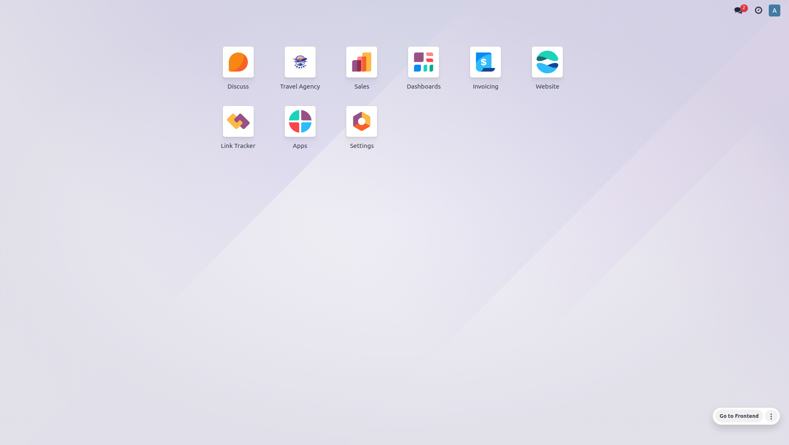
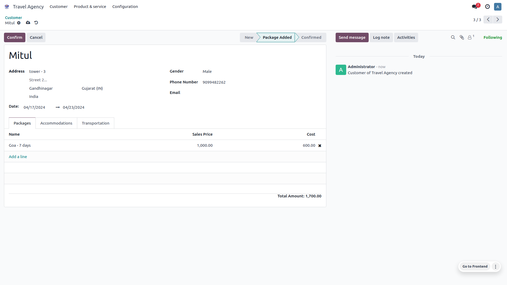
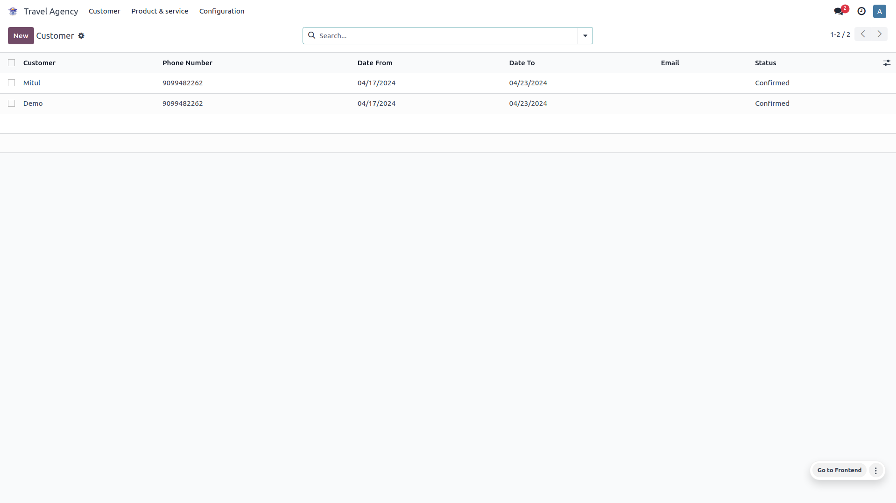
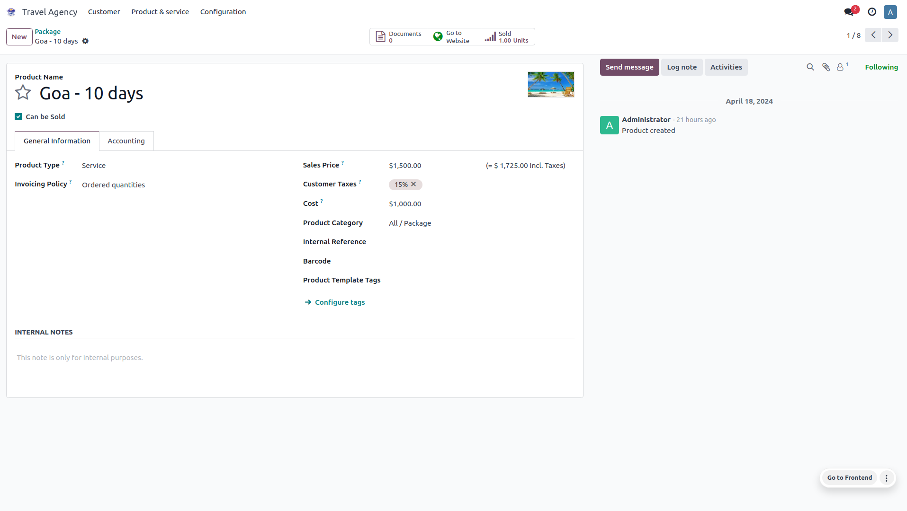
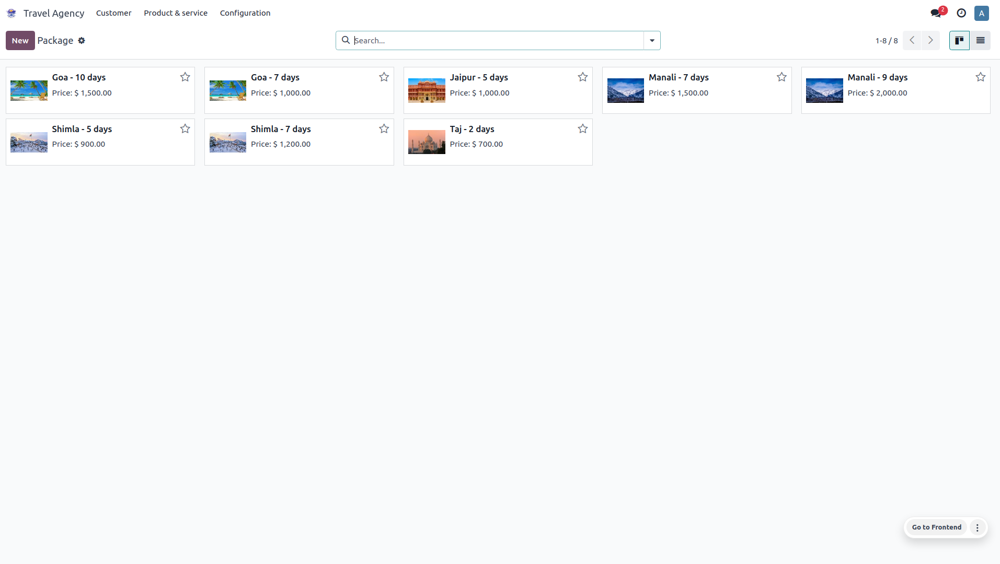
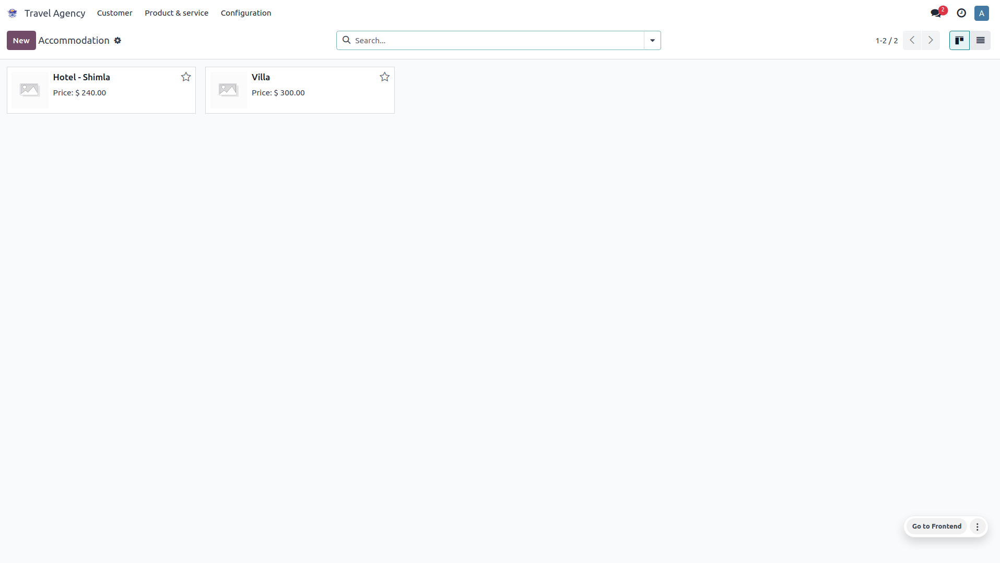
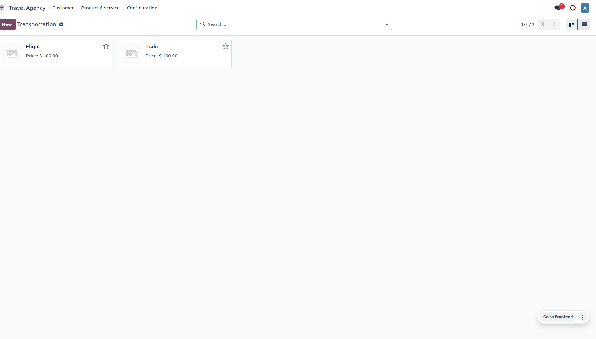
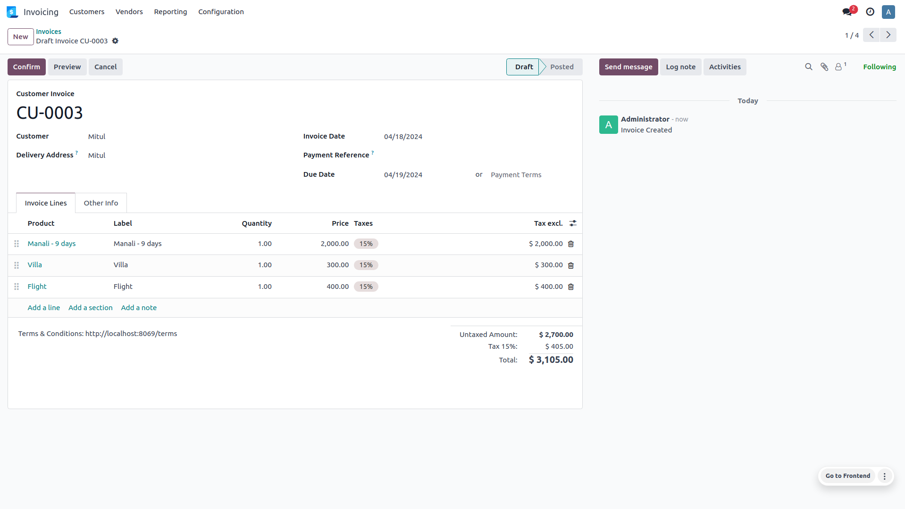
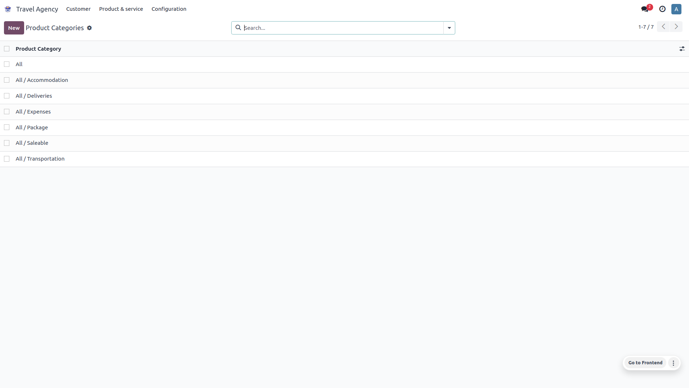
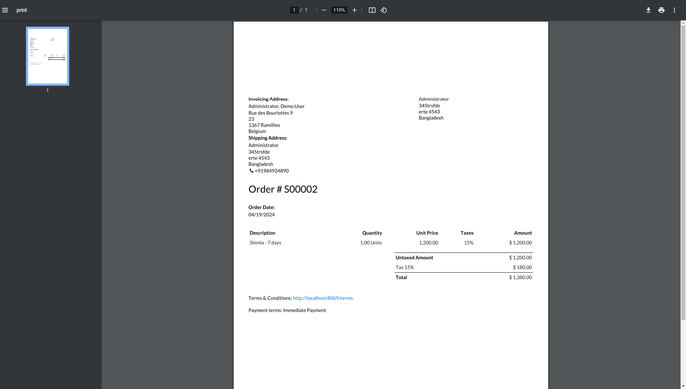

# Travel Agency Management App

## Overview

The Travel Agency Management App is an Odoo-based application designed to streamline the management of a travel agency. It provides features for handling customer details, package deals, accommodations, transportation, invoicing, and report generation, all in a seamless and user-friendly manner.

## Features

- **Customer Management**
  - Store and manage customer details.
  - Unified view for all customer-related information.

- **Package Management**
  - Create and manage travel packages.
  - Link packages with accommodations and transportation options.

- **Accommodation Management**
  - Manage different types of accommodations.
  - Link accommodations to travel packages.

- **Transportation Management**
  - Manage various transportation options.
  - Link transportation options to travel packages.

- **Invoicing**
  - Generate and manage invoices for bookings.
  - Seamless integration with customer and package details.

- **Reporting**
  - Generate detailed reports for bookings, invoices, and more.
  - Export reports for offline use.

